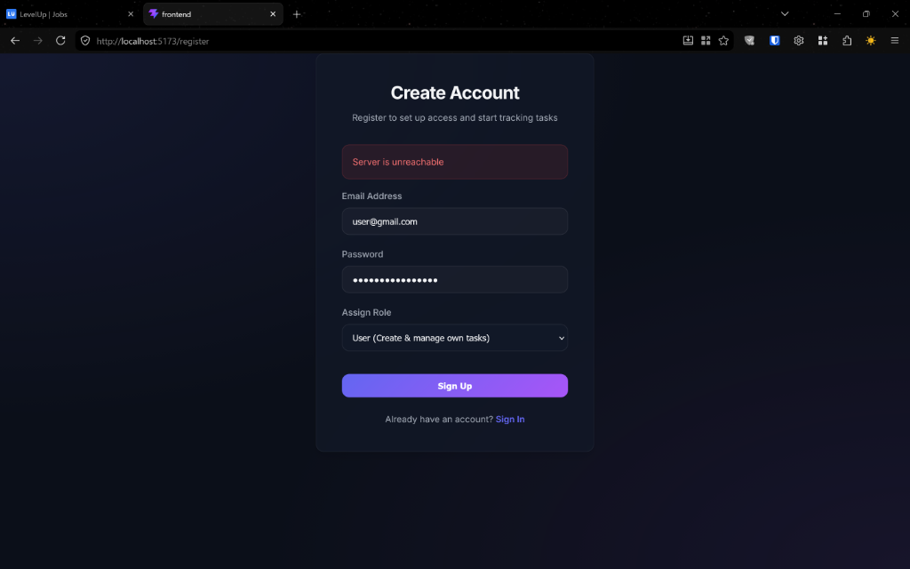
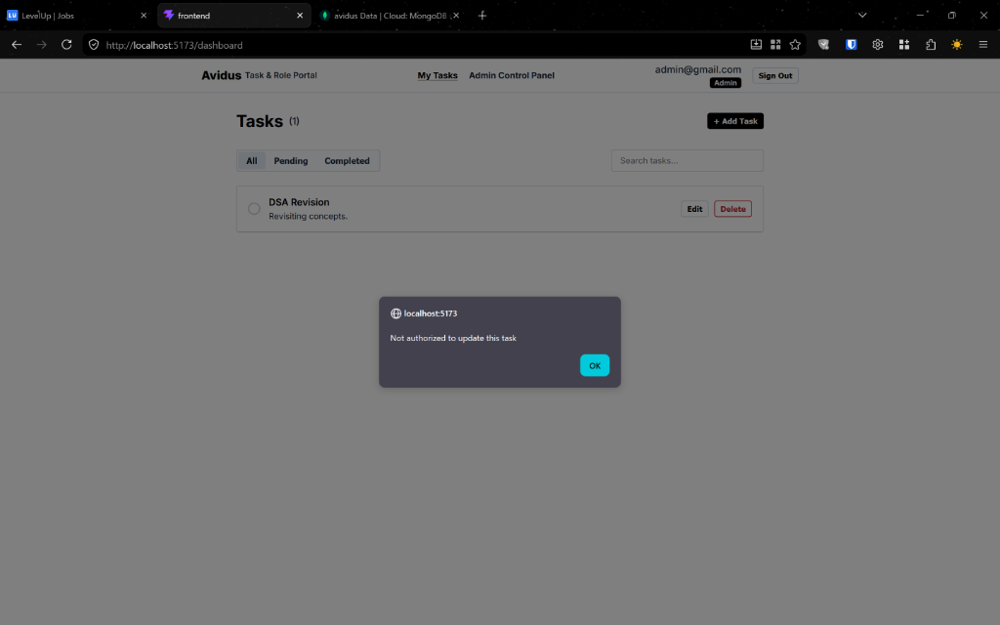

# Avidus RBAC & User Activity Portal

A modern, simplistic, and professional full-stack web application implementing Role-Based Access Control (RBAC) and user activity logging.

---

## 📸 Interface Screenshots

*Create a `screenshots/` folder at the root of the project and save your screenshots as `register.png`, `user-dashboard.png`, and `admin-dashboard.png` to display them here.*

### 1. User Sign Up


### 2. Personal Task Dashboard


### 3. Admin Control Panel


---

## 🚀 Key Features

### 1. Role-Based Authentication & Authorization (RBAC)
- JWT-based authentication with state stored in React Context.
- Active/Inactive account locks (suspension immediately revokes API access).
- Route guarding on both Frontend (Vite + React Router) and Backend (Express middlewares) to prevent unauthorized access.

### 2. User Dashboard (My Tasks)
- Flat, high-contrast, minimalist task list manager.
- Inline circle checkbox completion toggles.
- Search filters and status tabs (`All`, `Pending`, `Completed`).
- Personal task constraints: users can only view, edit, and delete their own tasks.

### 3. Admin Control Panel
- **Analytics Metrics:** Top counters displaying Total Users, Total Tasks, Completed Tasks, and Pending Tasks.
- **User Management:** Secure table to view registered users, toggle status (`Active`/`Inactive`), and delete accounts.
- **Task Monitoring:** System-wide overview of all tasks in the system with search capability and option to delete any task.
- **Activity Logs:** Audit timeline listing user logins, task creation, status updates, and deletions.

---

## 🛠️ Technology Stack
- **Backend:** Node.js, Express, MongoDB (via Mongoose), JSON Web Tokens (JWT), bcryptjs
- **Frontend:** React.js (Vite), React Router DOM
- **Deployment:** Vercel (includes `vercel.json` routing rewrites for both directories)
- **Styling:** Custom Flat Monochrome CSS (built with *Inter* typeface)

---

## ⚙️ Installation & Running Locally

### Prerequisites
- Node.js (v18+)
- MongoDB Atlas cluster URL (or a local MongoDB running database)

### Backend Setup
1. Navigate to the `backend/` directory:
   ```bash
   cd backend
   ```
2. Install dependencies:
   ```bash
   npm install
   ```
3. Create a `.env` file in the `backend/` directory and configure the variables:
   ```env
   MONGO_URI=mongodb+srv://<username>:<password>@cluster.mongodb.net/avidus?retryWrites=true&w=majority
   JWT_SECRET=your_jwt_secret_key_here
   ```
4. Start the backend:
   ```bash
   npm run dev
   ```

### Frontend Setup
1. Navigate to the `frontend/` directory:
   ```bash
   cd ../frontend
   ```
2. Install dependencies:
   ```bash
   npm install
   ```
3. Start the dev server:
   ```bash
   npm run dev
   ```
4. Open `http://localhost:5173` in your browser.

---

## ☁️ Deploying on Vercel

Both directories contain Vercel configuration files (`vercel.json` for Serverless Express function routing in the backend and route rewrites to prevent 404 page refreshes in the frontend).

### Environment Variables
When deploying on Vercel, make sure to set the following:
- **For Backend:**
  - `MONGO_URI`: Your MongoDB connection string.
  - `JWT_SECRET`: A secure string for signing tokens.
- **For Frontend:**
  - `VITE_API_URL`: Your deployed Vercel backend URL (e.g., `https://your-backend-url.vercel.app/api`).
